# Opções

## 1. O que são opções?

Uma opção é um contrato que dá ao titular um direito sobre determinado ativo.

- **Call:** direito de comprar
- **Put:** direito de vender

O comprador da opção paga um prêmio para adquirir esse direito. O vendedor recebe o prêmio e assume a obrigação correspondente.

Mantendo os demais fatores constantes, a parcela de valor relacionada ao tempo tende a diminuir conforme o vencimento se aproxima. Isso não significa, porém, que o preço da opção sempre cairá com o passar dos dias, pois ele também depende do comportamento do ativo e da volatilidade.

## 2. Elementos de uma opção

Os principais elementos de um contrato de opção são:

- **Ativo-objeto:** ativo ao qual a opção está ligada
- **Strike ou preço de exercício:** preço pelo qual o ativo poderá ser comprado ou vendido
- **Prêmio:** preço pago pela opção
- **Vencimento:** data final do contrato
- **Quantidade:** número de ativos abrangidos

Além desses elementos, o preço da opção é influenciado pelo preço do ativo, prazo, volatilidade, juros e dividendos esperados.

## 3. Titular e lançador

O **titular** é quem compra a opção. Ele paga o prêmio e recebe um direito.

O **lançador** é quem vende a opção. Ele recebe o prêmio e assume uma obrigação caso o titular exerça seu direito.

Quando alguém vende uma opção para abrir uma posição, não precisa ter comprado aquela opção anteriormente. Nesse caso, está criando uma posição lançadora.

Como o lançador pode ser obrigado a comprar ou vender o ativo, sua posição pode exigir margem de garantia. Já o titular de uma opção isolada tem sua perda máxima limitada ao prêmio pago.

A lógica principal é:

| Posição | O que possui |
|---|---|
| **Compra de call** | Direito de comprar |
| **Venda de call** | Obrigação de vender |
| **Compra de put** | Direito de vender |
| **Venda de put** | Obrigação de comprar |

## 4. Margem de garantia e margin call

Algumas posições em derivativos podem gerar perdas superiores ao valor inicialmente recebido ou depositado. Por isso, a corretora ou a câmara de compensação pode exigir uma **margem de garantia**.

A margem funciona como um colateral para assegurar que o investidor conseguirá cumprir suas obrigações. Ela pode ser composta por dinheiro ou por ativos aceitos como garantia, de acordo com as regras aplicáveis.

A exigência de margem aparece principalmente em:

- contratos futuros
- opções vendidas
- operações alavancadas
- estratégias que podem gerar obrigações futuras

O valor exigido não é necessariamente fixo. Ele pode mudar conforme:

- o preço do ativo
- a volatilidade
- o prazo até o vencimento
- o tamanho e o risco da posição
- as demais posições da carteira

### O que é uma margin call?

A **margin call**, ou chamada de margem, acontece quando as garantias depositadas deixam de ser suficientes para cobrir o risco da posição.

Nesse caso, o investidor precisa depositar recursos ou ativos adicionais. Caso não recomponha a margem dentro do prazo determinado, a corretora poderá reduzir ou encerrar posições para controlar o risco.

!!! example "Exemplo"
    Um investidor vende uma call descoberta e deposita R$ 10 mil em garantias.

    Se o preço da ação subir muito, o risco da posição aumenta. Com isso, a margem exigida pode subir para R$ 15 mil.

    O investidor terá de depositar mais R$ 5 mil. Essa solicitação adicional é a chamada de margem.

!!! warning "Importante"
    Margem de garantia não representa a perda máxima da operação. Ela é apenas o valor exigido como proteção diante do risco estimado. A perda efetiva pode ser maior.

## 5. Exercício, encerramento e vencimento

Uma posição em opções não precisa necessariamente chegar ao exercício.

Antes do vencimento, o investidor pode encerrar sua posição realizando a operação contrária:

- quem comprou uma opção pode vendê-la
- quem vendeu uma opção pode recomprá-la

Ao fazer isso, o investidor realiza o ganho ou a perda acumulada e deixa de possuir aquela posição.

Caso a opção seja mantida até o vencimento, ela poderá ser exercida se estiver dentro do dinheiro. Dependendo do contrato, o exercício pode resultar na compra ou venda do ativo-objeto ou em uma liquidação financeira.

As opções também podem ser classificadas de acordo com o momento em que admitem exercício:

- **Opção americana:** pode ser exercida antes do vencimento, conforme as regras do contrato
- **Opção europeia:** somente pode ser exercida na data de vencimento

Para o lançador de uma opção americana, isso significa que existe a possibilidade de exercício antecipado.

## 6. Moneyness: ITM, ATM e OTM

O **moneyness** mostra a relação entre o strike da opção e o preço atual do ativo.

### Call

- **ITM (in the money):** strike abaixo do preço do ativo
- **ATM (at the money):** strike próximo do preço do ativo
- **OTM (out of the money):** strike acima do preço do ativo

### Put

- **ITM:** strike acima do preço do ativo
- **ATM:** strike próximo do preço do ativo
- **OTM:** strike abaixo do preço do ativo

Uma opção ITM possui valor econômico imediato caso seja exercida. Uma opção OTM não possui valor intrínseco naquele momento.

## 7. Valor intrínseco e valor extrínseco

O prêmio de uma opção pode ser dividido em duas partes.

**Valor intrínseco** é o ganho imediato que existiria caso a opção fosse exercida naquele momento. Uma opção somente possui valor intrínseco quando está ITM.

**Valor extrínseco** é a parcela do prêmio associada à possibilidade de a opção se tornar mais valiosa até o vencimento. Ela depende principalmente de:

- tempo restante
- volatilidade
- juros
- dividendos esperados
- relação entre o strike e o preço do ativo

As opções ATM normalmente concentram maior valor extrínseco, pois existe maior incerteza sobre terminarem dentro ou fora do dinheiro.

## 8. Payoff e resultado líquido

O **payoff** mostra o valor da opção ou da estratégia no vencimento. Já o resultado líquido considera também o prêmio pago ou recebido na montagem da posição.

!!! example "Exemplo"
    Uma call com strike de R$ 100, prêmio de R$ 4, e preço do ativo no vencimento de R$ 110.

    A call terá valor de R$ 10 no vencimento, pois permite comprar por R$ 100 algo que vale R$ 110.

    Porém, como o investidor pagou R$ 4 pelo contrato, seu lucro líquido será de R$ 6.

Por isso, é importante verificar se um gráfico representa apenas o payoff no vencimento ou o resultado completo da operação, já considerando os prêmios.

## 9. Break-even

O **break-even**, ou ponto de equilíbrio, é o preço do ativo a partir do qual a operação começa a gerar lucro ou prejuízo no vencimento.

- Em uma call comprada: **Break-even = strike + prêmio pago**
- Em uma put comprada: **Break-even = strike − prêmio pago**

O strike mostra quando a opção passa a ter valor intrínseco. O break-even considera também o custo pago para montar a posição.

## 10. Precificação de opções

O preço de uma opção depende de diversas variáveis. O modelo **Black-Scholes** é uma das principais referências utilizadas para calcular seu valor teórico.

O modelo não determina necessariamente o preço pelo qual a opção será negociada. Ele fornece uma estimativa baseada em fatores como:

- preço atual do ativo
- strike
- prazo até o vencimento
- volatilidade
- taxa de juros
- dividendos esperados

O preço efetivamente negociado depende da oferta e da demanda no mercado.

### Volatilidade histórica e volatilidade implícita

A **volatilidade histórica** mede quanto o preço do ativo oscilou no passado.

Já a **volatilidade implícita** é obtida a partir dos preços das opções negociadas no mercado. Ela representa a volatilidade que está incorporada no prêmio da opção.

Quanto maior a volatilidade implícita, maior tende a ser o preço da opção, pois aumenta a possibilidade de o ativo apresentar movimentos relevantes até o vencimento.

Strikes e vencimentos diferentes podem apresentar volatilidades implícitas diferentes. Essa relação é frequentemente representada por uma **superfície de volatilidade**.

## 11. Gregas

As gregas medem como o preço da opção tende a reagir a mudanças nos fatores que determinam seu valor.

**Delta** — mostra quanto o preço da opção tende a variar quando o ativo se movimenta em R$ 1,00. Uma call normalmente possui delta positivo, pois tende a valorizar quando o ativo sobe. Uma put normalmente possui delta negativo.

**Theta** — mede o efeito da passagem do tempo sobre o valor da opção. Para posições compradas, o theta normalmente é negativo, pois o tempo restante para a opção se valorizar diminui. Para posições vendidas, o theta normalmente é positivo. A perda de valor temporal tende a se acelerar próximo ao vencimento, principalmente em opções próximas do dinheiro.

**Gamma** — mede quanto o delta da opção tende a variar quando o preço do ativo muda. Uma opção com gamma elevado pode apresentar mudanças mais rápidas em sua exposição ao ativo.

**Vega** — mede a sensibilidade da opção a mudanças na volatilidade implícita. Quanto maior o vega, maior tende a ser o impacto de uma alteração na volatilidade sobre o preço da opção.

**Rho** — mede a sensibilidade da opção a mudanças na taxa de juros. Em opções de prazos curtos, seu efeito costuma ser menor. Em contratos mais longos, a influência dos juros pode se tornar mais relevante.

## 12. As quatro posições básicas

Toda estratégia com opções é formada a partir de quatro posições fundamentais: compra de call, venda de call, compra de put e venda de put.

### Compra de Call — Long Call

Ao comprar uma call, o investidor adquire o direito de comprar o ativo pelo strike. É uma posição utilizada quando se espera uma alta do ativo.

- **Ganho potencial:** teoricamente ilimitado
- **Perda máxima:** prêmio pago
- **Break-even:** strike mais prêmio pago

No vencimento, se o ativo estiver acima do strike, a call terá valor intrínseco. Se estiver abaixo, poderá vencer sem valor e a perda ficará limitada ao prêmio.

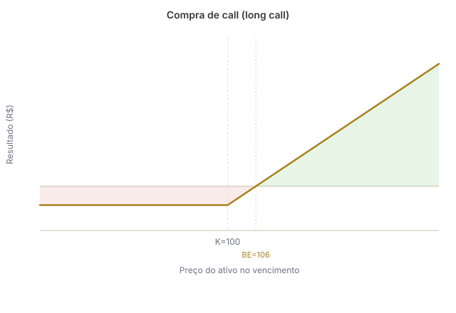{ .payoff-chart }

### Venda de Call — Short Call

Ao vender uma call, o investidor assume a obrigação de vender o ativo pelo strike caso seja exercido. Uma call descoberta pode ser utilizada quando se espera estabilidade ou queda do ativo, mas envolve risco elevado.

- **Ganho máximo:** prêmio recebido
- **Perda potencial:** teoricamente ilimitada
- **Break-even:** strike mais prêmio recebido

Se o preço do ativo subir muito, o lançador continuará obrigado a vendê-lo pelo strike.

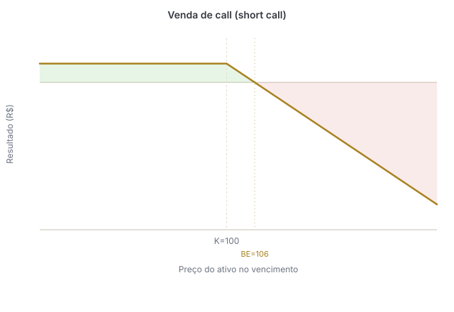{ .payoff-chart }

### Compra de Put — Long Put

Ao comprar uma put, o investidor adquire o direito de vender o ativo pelo strike. A posição pode ser utilizada quando se espera queda do ativo ou quando se busca proteção para uma posição comprada.

- **Ganho potencial:** aumenta conforme o ativo cai, mas é limitado pelo fato de o preço do ativo não poder cair abaixo de zero
- **Perda máxima:** prêmio pago
- **Break-even:** strike menos prêmio pago

Quanto menor o preço do ativo no vencimento, maior tende a ser o valor da put.

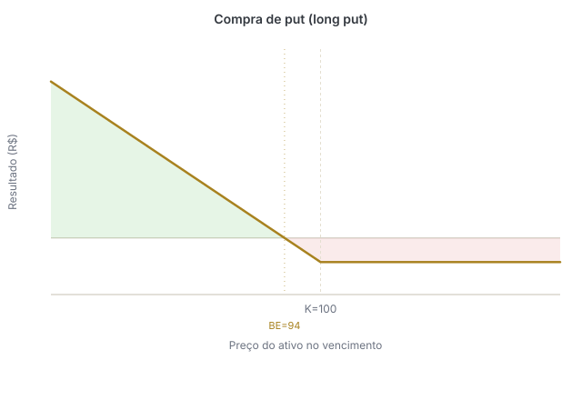{ .payoff-chart }

### Venda de Put — Short Put

Ao vender uma put, o investidor assume a obrigação de comprar o ativo pelo strike caso seja exercido. A posição pode ser utilizada quando se acredita que o ativo permanecerá estável ou irá subir.

- **Ganho máximo:** prêmio recebido
- **Perda potencial:** relevante caso o ativo caia, mas limitada ao cenário em que seu preço chega a zero
- **Break-even:** strike menos prêmio recebido

Na prática, o lançador está assumindo o compromisso de comprar o ativo por um preço definido previamente.

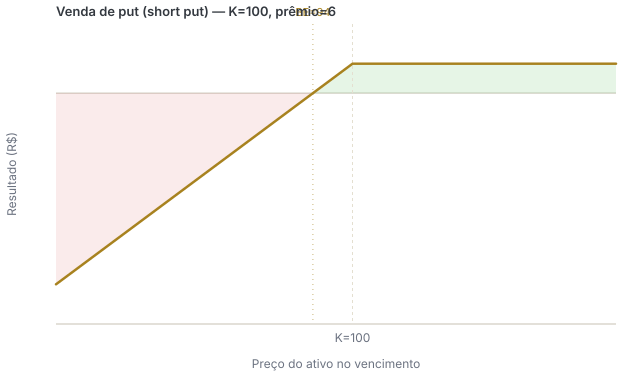{ .payoff-chart }

!!! note "Dica"
    Call está relacionada à compra e put à venda. Quem compra uma opção adquire um direito. Quem vende ou lança uma opção assume uma obrigação.

## 13. Venda coberta de call

Na venda coberta, o investidor possui o ativo em carteira e vende uma call sobre ele.

Ao receber o prêmio, ele aumenta a renda da posição. Em contrapartida, assume o compromisso de vender o ativo pelo strike caso a call seja exercida.

A estratégia costuma fazer sentido quando o investidor acredita que o ativo ficará estável ou terá uma alta limitada.

- O investidor já possui o ativo
- Recebe o prêmio da call
- Mantém o risco de queda da ação
- Limita seu ganho acima do strike

Como as ações em carteira cobrem a obrigação de entrega, o risco é diferente do de uma call vendida a descoberto.

Em algumas abordagens práticas, busca-se vender opções com volatilidade implícita mais elevada e prazo entre aproximadamente 20 e 35 dias até o vencimento. Esses números servem apenas como referência e podem variar conforme o ativo, o mercado e o objetivo da operação.

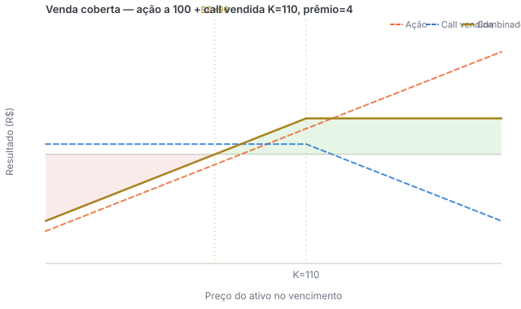{ .payoff-chart }

## 14. Venda descoberta de call

Na venda descoberta de call, o lançador não possui o ativo necessário para cumprir a obrigação.

Se o preço subir e a call for exercida, ele poderá precisar comprar o ativo por um preço elevado para entregá-lo pelo strike.

Por isso:

- o ganho máximo é limitado ao prêmio recebido
- a perda potencial é teoricamente ilimitada
- normalmente há exigência de margem de garantia
- a posição pode gerar chamadas adicionais de margem caso o risco aumente

Essa operação não deve ser confundida com a venda a descoberto de uma ação, em que o investidor toma o próprio ativo emprestado, vende e pretende recomprá-lo por um preço menor.

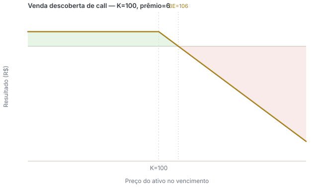{ .payoff-chart }

## 15. Outras estratégias comuns

As quatro posições básicas podem ser combinadas para criar diferentes perfis de risco e retorno.

### Protective put

**Montagem:** ação comprada + put comprada.

O investidor mantém o potencial de valorização da ação, mas compra uma put para limitar sua perda caso o preço caia. A estratégia funciona de maneira semelhante à contratação de um seguro: o prêmio pago pela put representa o custo da proteção.

- **Expectativa:** alta do ativo, mas com proteção contra quedas
- **Ganho potencial:** acompanha a valorização da ação, descontado o prêmio
- **Perda máxima:** limitada pelo strike da put, considerando o preço de compra da ação e o prêmio pago

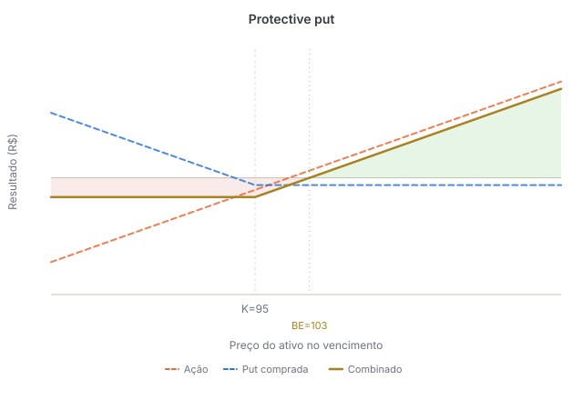{ .payoff-chart }

### Collar

**Montagem:** ação comprada + put comprada + call vendida.

A put estabelece um nível de proteção para a queda, enquanto o prêmio recebido pela call ajuda a reduzir ou financiar o custo da put. Em contrapartida, o ganho da posição fica limitado acima do strike da call.

- **Expectativa:** manutenção ou alta moderada do ativo
- **Ganho máximo:** limitado pelo strike da call
- **Perda máxima:** limitada pelo strike da put
- **Custo:** pode ser reduzido pelo prêmio recebido na venda da call

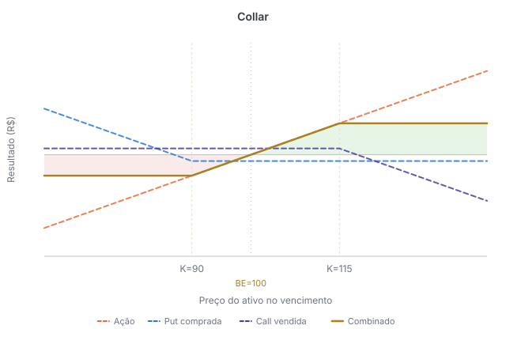{ .payoff-chart }

### Trava de alta com calls

**Montagem:** compra de uma call + venda de outra call com strike superior (mesmo ativo-objeto, quantidade e vencimento).

É utilizada quando se espera uma alta moderada do ativo. A call vendida reduz o custo da operação, mas também limita o ganho.

- **Expectativa:** alta moderada
- **Ganho máximo:** diferença entre os strikes menos o prêmio líquido pago
- **Perda máxima:** prêmio líquido pago
- **Break-even:** strike da call comprada mais o prêmio líquido pago

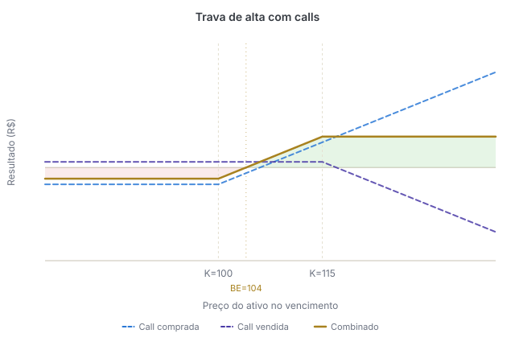{ .payoff-chart }

### Trava de baixa com puts

**Montagem:** compra de uma put + venda de outra put com strike inferior (mesmo ativo-objeto, quantidade e vencimento).

É utilizada quando se espera uma queda moderada do ativo. A put vendida reduz o custo inicial, mas limita o ganho caso o ativo caia muito.

- **Expectativa:** queda moderada
- **Ganho máximo:** diferença entre os strikes menos o prêmio líquido pago
- **Perda máxima:** prêmio líquido pago
- **Break-even:** strike da put comprada menos o prêmio líquido pago

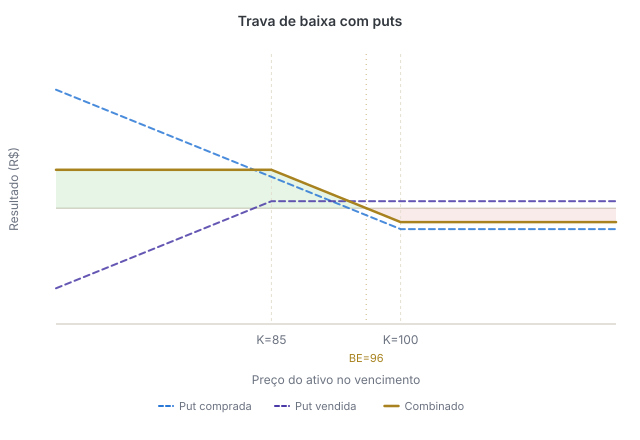{ .payoff-chart }

### Straddle comprado

**Montagem:** compra de uma call + compra de uma put com o mesmo strike e vencimento.

A estratégia é utilizada quando se espera um movimento forte do ativo, mas não se sabe em qual direção. O investidor pode ganhar tanto com uma alta quanto com uma queda expressiva. Porém, como compra duas opções, precisa que o movimento seja suficiente para compensar os dois prêmios pagos.

- **Expectativa:** aumento relevante da volatilidade ou movimento forte do ativo
- **Ganho potencial:** elevado em altas ou quedas fortes
- **Perda máxima:** soma dos prêmios pagos
- **Maior perda:** ocorre quando o ativo termina próximo ao strike

A estratégia possui dois pontos de break-even:

- **Break-even superior:** strike + total dos prêmios
- **Break-even inferior:** strike − total dos prêmios

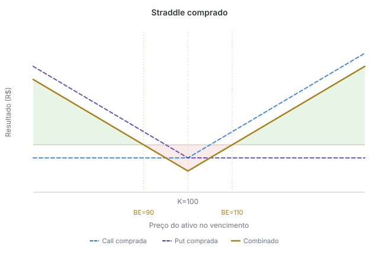{ .payoff-chart }

### Strangle comprado

**Montagem:** compra de uma put com strike inferior + compra de uma call com strike superior (mesmo ativo-objeto e vencimento).

Assim como o straddle, o strangle é utilizado quando se espera um movimento forte sem uma direção definida. Seu custo normalmente é menor, mas o ativo precisa apresentar uma oscilação maior para gerar lucro.

- **Expectativa:** movimento forte ou aumento da volatilidade
- **Ganho potencial:** elevado em altas ou quedas fortes
- **Perda máxima:** soma dos prêmios pagos
- **Maior perda:** ocorre quando o ativo termina entre os dois strikes

Pontos de break-even:

- **Break-even superior:** strike da call + total dos prêmios
- **Break-even inferior:** strike da put − total dos prêmios

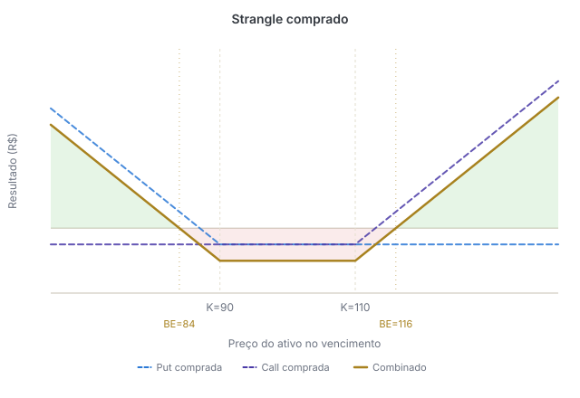{ .payoff-chart }

## 16. Paridade entre call e put

Calls, puts, o ativo à vista e contratos a termo possuem uma relação de equivalência entre seus preços. Essa relação é conhecida como **paridade put-call**.

A lógica é que duas combinações que geram o mesmo resultado no vencimento devem possuir valores econômicos compatíveis.

Caso uma combinação fosse negociada por um preço muito diferente da outra, poderia surgir uma oportunidade de arbitragem.

É essa relação que permite reproduzir um contrato a termo por meio de uma call e de uma put com o mesmo ativo, strike e vencimento.

## 17. Termo sintético

### O que é?

Um termo sintético é uma combinação de duas opções que reproduz o resultado financeiro de um contrato a termo.

Ele pode ser utilizado, por exemplo, quando uma posição a termo está próxima do vencimento e o investidor deseja manter a exposição ao ativo por mais tempo.

Para que a equivalência funcione, a call e a put devem possuir o mesmo ativo-objeto, o mesmo strike, o mesmo vencimento e a mesma quantidade.

### Termo sintético comprado

Para reproduzir um termo comprado: **compra de call + venda de put**

- A call comprada dá o direito de comprar o ativo pelo strike
- A put vendida gera a obrigação de comprar o ativo pelo strike caso seja exercida

No vencimento:

- se o ativo estiver acima do strike, a call estará ITM
- se estiver abaixo do strike, a put vendida estará ITM
- se estiver exatamente no strike, normalmente nenhuma das opções será exercida

Desconsiderando os prêmios e os custos da operação, o resultado no vencimento é: **preço do ativo − strike**

Por isso, a posição ganha quando o ativo sobe e perde quando ele cai, assim como um termo comprado.

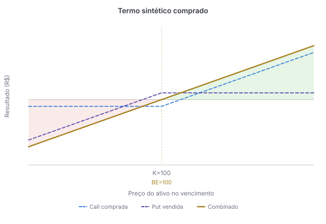{ .payoff-chart }

### Termo sintético vendido

Para reproduzir um termo vendido: **venda de call + compra de put**

- A call vendida gera a obrigação de vender o ativo pelo strike
- A put comprada dá o direito de vender o ativo pelo strike

No vencimento:

- se o ativo estiver acima do strike, a call vendida estará ITM
- se estiver abaixo do strike, a put comprada estará ITM
- se estiver exatamente no strike, normalmente nenhuma das opções será exercida

Desconsiderando prêmios e custos, o resultado é: **strike − preço do ativo**

Assim, a posição ganha quando o ativo cai e perde quando ele sobe, como em um termo vendido.

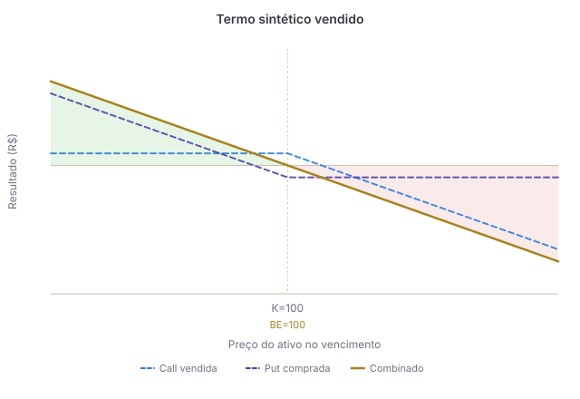{ .payoff-chart }

### Uso em uma rolagem

Quando um termo está próximo do vencimento, o investidor pode:

1. Encerrar ou liquidar a posição existente
2. Montar um termo sintético com vencimento mais longo
3. Manter sua exposição ao preço do ativo

Não basta, porém, escolher duas opções quaisquer. O preço econômico da posição depende do strike, dos prêmios, dos juros, dos dividendos esperados, dos custos e da margem exigida.

Caso o investidor não queira receber ou entregar o ativo no vencimento, pode encerrar as duas opções antes do exercício e montar um novo sintético com vencimento posterior.

Se as opções forem mantidas abertas e terminarem dentro do dinheiro, o exercício poderá gerar a compra ou a venda efetiva do ativo.
